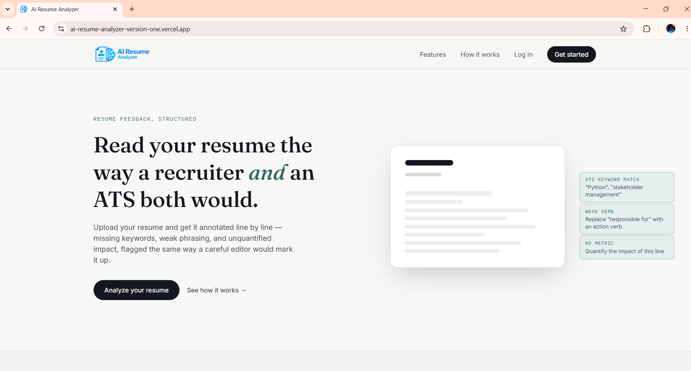
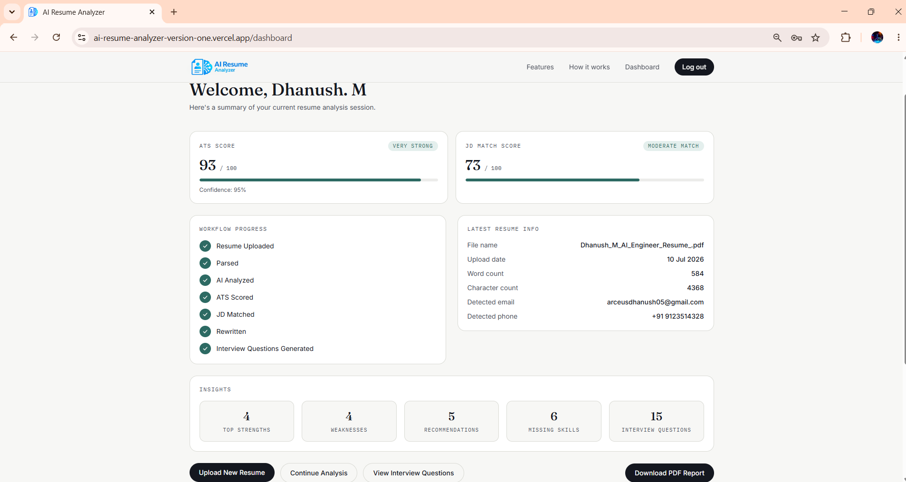
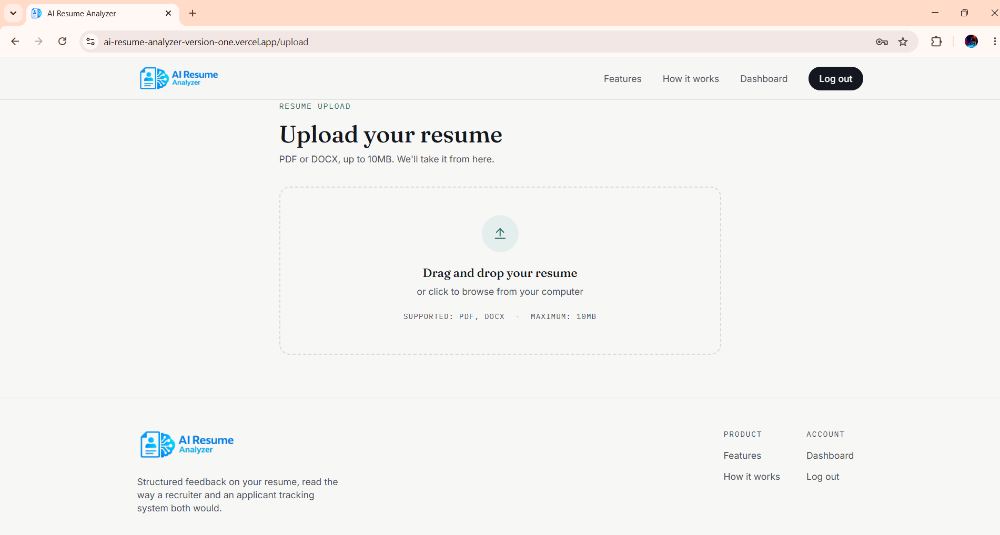
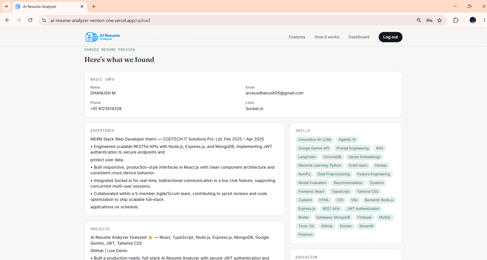
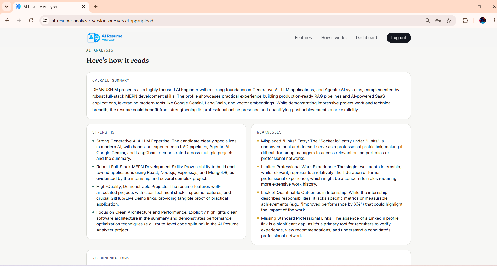
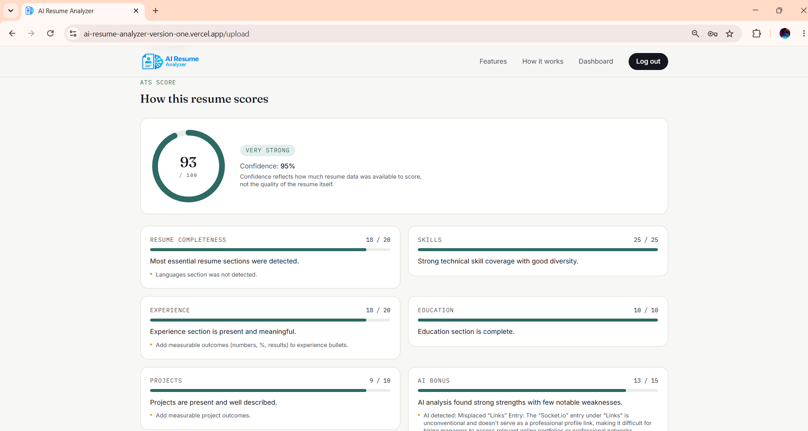
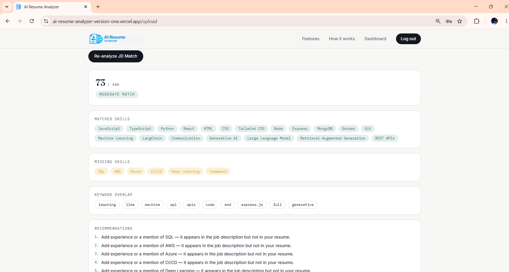
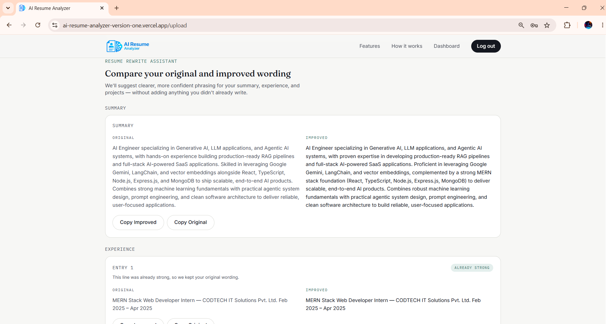
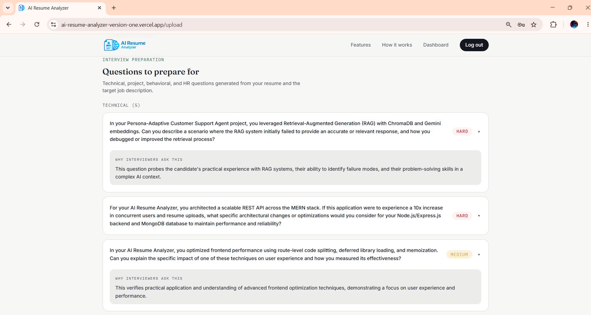
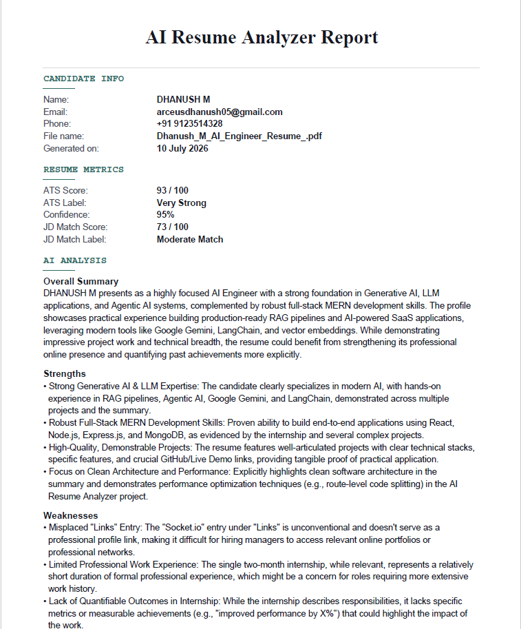

<div align="center">


# AI Resume Analyzer

### Production-ready AI-powered resume analysis platform

Analyze resumes from both a recruiter and ATS perspective using deterministic scoring and Google Gemini AI.

<br />

[](https://ai-resume-analyzer-version-one.vercel.app)
[](https://ai-resume-analyzer-e67b.onrender.com)
[](https://github.com/DhanushArceus05/ai-resume-analyzer)

<br />


</div>

---

## About the Project

AI Resume Analyzer is a full-stack SaaS platform that evaluates resumes from both a **recruiter** and an **Applicant Tracking System** perspective.

It parses PDF and DOCX resumes, generates AI-powered feedback, calculates deterministic ATS scores, compares resumes with job descriptions, rewrites weak sections, creates personalized interview questions, and exports professional PDF reports.

## 🌐 Live Application

| Service | URL |
|---|---|
| Frontend | [Open AI Resume Analyzer](https://ai-resume-analyzer-version-one.vercel.app) |
| Backend API | [Open Render API](https://ai-resume-analyzer-e67b.onrender.com) |
| Source Code | [View GitHub Repository](https://github.com/DhanushArceus05/ai-resume-analyzer) |

---

# ✨ Features

## Authentication

- Secure User Registration
- JWT Authentication
- Login & Logout
- Protected Routes
- Session Persistence
- User Data Isolation

---

## Resume Upload

- Drag & Drop Upload
- Click to Browse
- PDF Support
- DOCX Support
- File Validation
- Upload Progress Animation

---

## Resume Parsing

Automatically extracts:

- Personal Information
- Professional Summary
- Skills
- Experience
- Education
- Projects
- Certifications
- Resume Metadata

---

## AI Resume Analysis

Powered by **Google Gemini AI**

Provides:

- Resume Strengths
- Resume Weaknesses
- Improvement Suggestions
- Overall Resume Quality
- Recruiter-style Feedback

---

## ATS Score

Deterministic ATS Engine

Calculates:

- ATS Compatibility Score
- Keyword Optimization
- Formatting Quality
- Skill Coverage
- Missing Keywords
- Improvement Recommendations

---

## Job Description Matching

Paste any Job Description and receive:

- Match Percentage
- Matching Skills
- Missing Skills
- Keyword Analysis
- Personalized Recommendations

---

## Resume Rewrite

AI-powered rewrite suggestions for:

- Professional Summary
- Experience
- Projects
- Resume Bullet Points

---

## Interview Question Generator

Generates personalized:

- Technical Questions
- HR Questions
- Behavioral Questions
- Project-based Questions

Based on:

- Resume
- ATS Analysis
- JD Matching
- AI Resume Analysis

---

## Dashboard

- Resume Health Summary
- Workflow Progress
- Quick Actions
- Report Management
- Latest Analysis

---

## PDF Report

Download a professional PDF report including:

- AI Analysis
- ATS Score
- JD Match
- Resume Rewrite
- Interview Questions

---

# 🏗️ Architecture

## Backend Architecture

```
routes
   │
middleware
   │
controllers
   │
services
   │
providers
   │
utils
```

### Design Principles

- Thin Controllers (No Business Logic)
- Service-Oriented Architecture
- Single Responsibility Principle
- Modular AI Provider Layer
- Deterministic ATS Engine
- Explainable JD Matching
- Secure JWT Authentication

---

## Frontend Architecture

```
pages
   │
components
   │
services
   │
hooks
   │
types
   │
utils
```

### Frontend Highlights

- React 19
- TypeScript
- Vite
- Tailwind CSS
- Framer Motion
- React Router
- Axios API Layer
- jsPDF Report Generator

---

# 🛠 Tech Stack

## Frontend

- React 19
- TypeScript
- Vite
- Tailwind CSS
- Framer Motion
- React Router DOM
- Axios
- jsPDF

---

## Backend

- Node.js
- Express.js
- MongoDB Atlas
- Mongoose
- JWT Authentication
- bcryptjs
- Multer

---

## Artificial Intelligence

- Google Gemini AI
- Prompt Engineering
- AI Resume Analysis
- Resume Rewrite
- Interview Question Generation

---

## Resume Processing

- pdf-parse
- Mammoth

---

## Deployment

| Service | Platform |
|----------|----------|
| Frontend | Vercel |
| Backend | Render |
| Database | MongoDB Atlas |

---

# 📸 Product Screenshots

## Landing Page

<p align="center">
  
</p>

---

## Dashboard Overview

<p align="center">
  
</p>

---

## Resume Upload and Parsing

<table>
  <tr>
    <td width="50%">
      
    </td>
    <td width="50%">
      
    </td>
  </tr>
  <tr>
    <td align="center"><strong>Resume Upload</strong></td>
    <td align="center"><strong>Parsed Resume Preview</strong></td>
  </tr>
</table>

---

## AI Analysis and ATS Scoring

<table>
  <tr>
    <td width="50%">
      
    </td>
    <td width="50%">
      
    </td>
  </tr>
  <tr>
    <td align="center"><strong>AI Resume Analysis</strong></td>
    <td align="center"><strong>ATS Compatibility Score</strong></td>
  </tr>
</table>

---

## Job Matching and Resume Rewrite

<table>
  <tr>
    <td width="50%">
      
    </td>
    <td width="50%">
      
    </td>
  </tr>
  <tr>
    <td align="center"><strong>Job Description Matching</strong></td>
    <td align="center"><strong>AI Resume Rewrite</strong></td>
  </tr>
</table>

---

## Interview Preparation

<p align="center">
  
</p>

---

## PDF Report

<p align="center">
  
</p>

---

Suggested screenshots:

- Landing Page
- Login Page
- Register Page
- Upload Resume
- Resume Dashboard
- AI Analysis
- ATS Score
- JD Matching
- Resume Rewrite
- Interview Questions
- PDF Report

---

# 🚀 Installation

## Clone Repository

```bash
git clone https://github.com/DhanushArceus05/ai-resume-analyzer.git
```

```
cd ai-resume-analyzer
```

---

## Install Backend

```bash
cd backend

npm install
```

---

## Install Frontend

```bash
cd frontend

npm install
```

---

# ▶️ Run Development

## Backend

```bash
cd backend

npm run dev
```

Runs on

```
http://localhost:5000
```

---

## Frontend

```bash
cd frontend

npm run dev
```

Runs on

```
http://localhost:5173
```

---

# 📁 Project Structure

```
AI-Resume-Analyzer
│
├── backend
│   ├── src
│   │   ├── config
│   │   ├── controllers
│   │   ├── middleware
│   │   ├── models
│   │   ├── providers
│   │   ├── routes
│   │   ├── services
│   │   ├── utils
│   │   └── server.js
│   │
│   ├── scripts
│   ├── package.json
│   ├── .env.example
│   └── README.md
│
├── frontend
│   ├── src
│   │   ├── components
│   │   ├── contexts
│   │   ├── hooks
│   │   ├── layouts
│   │   ├── pages
│   │   ├── services
│   │   ├── types
│   │   ├── utils
│   │   └── App.tsx
│   │
│   ├── public
│   ├── package.json
│   ├── .env.example
│   └── README.md
│
├── DEPLOYMENT.md
├── PRODUCTION_CHECKLIST.md
├── PREMIUM_RELEASE_CHECKLIST.md
├── LICENSE
└── README.md
```

---

# 🔑 Environment Variables

## Backend

Create:

```
backend/.env
```

Example:

```env
NODE_ENV=development

PORT=5000

CLIENT_URL=http://localhost:5173

MONGODB_URI=your_mongodb_connection_string

JWT_SECRET=your_jwt_secret

JWT_EXPIRES_IN=7d

GEMINI_API_KEY=your_gemini_api_key

GEMINI_MODEL=gemini-2.5-flash

GEMINI_TIMEOUT_MS=60000
```

---

## Frontend

Create:

```
frontend/.env
```

```env
VITE_API_BASE_URL=http://localhost:5000/api
```

---

# 📡 API Endpoints

## Authentication

```
POST /api/auth/register

POST /api/auth/login

GET /api/auth/me
```

---

## Resume

```
POST /api/upload

GET /api/report/latest

DELETE /api/report
```

---

## AI

```
POST /api/analyze

POST /api/ats

POST /api/jd-match

POST /api/rewrite

POST /api/interview
```

---

# 🚀 Deployment

## Frontend

Platform

```
Vercel
```

Root Directory

```
frontend
```

Environment Variable

```env
VITE_API_BASE_URL=https://your-render-backend.onrender.com/api
```

---

## Backend

Platform

```
Render
```

Root Directory

```
backend
```

Build Command

```bash
npm install
```

Start Command

```bash
npm start
```

Environment Variables

```env
NODE_ENV=production

CLIENT_URL=https://your-vercel-app.vercel.app

MONGODB_URI=...

JWT_SECRET=...

JWT_EXPIRES_IN=7d

GEMINI_API_KEY=...

GEMINI_MODEL=gemini-2.5-flash

GEMINI_TIMEOUT_MS=60000
```

---

## Database

Platform

```
MongoDB Atlas
```

---

# 🔒 Security

- JWT Authentication
- Password Hashing (bcrypt)
- Secure Environment Variables
- Protected Routes
- User Data Isolation
- CORS Protection
- Helmet Security Headers
- File Upload Validation
- Resume Size Validation
- API Error Handling

---

# 🚀 Version 2 Roadmap

The following features are planned for the next major release.

## 🤖 AI Improvements

- Multi-AI Provider Support
  - Google Gemini
  - OpenAI GPT
  - Anthropic Claude
  - Groq
  - OpenRouter

- Automatic AI Provider Fallback
- AI Response Caching
- Faster AI Pipeline
- Better Prompt Optimization

---

## 📱 Mobile Experience

- Complete Mobile Responsiveness
- Responsive Dashboard
- Better Card Layout
- Better Form Layout
- No Content Overlapping
- Improved Tablet Support
- Improved Small Screen Support

---

## 📄 Resume Features

- Resume Version History
- Compare Resume Versions
- Resume Templates
- Resume Builder
- AI Cover Letter Generator

---

## 💼 Interview Preparation

- AI Interview Answer Evaluation
- Mock Interview Mode
- AI Feedback
- Interview Score
- Communication Analysis

---

## 📊 Analytics

- Usage Dashboard
- AI Usage Statistics
- Resume Improvement History
- ATS Progress Tracking

---

## ☁️ Cloud Features

- Cloud Resume Storage
- Multiple Resume Management
- Resume Sharing
- Public Resume Link

---

# ⚡ Performance

Current optimizations include:

- Route-level code splitting
- Lazy loading
- React.memo optimization
- Memoized Context API
- Optimized local storage
- Per-user report isolation
- Dynamic jsPDF loading
- Accessibility improvements
- Production-ready build
- Secure authentication
- Optimized API communication

---

# 🏆 Project Highlights

✔ Production Ready

✔ Responsive Desktop UI

✔ JWT Authentication

✔ MongoDB Atlas

✔ Google Gemini AI

✔ ATS Engine

✔ Job Description Matching

✔ Resume Rewrite

✔ Interview Question Generation

✔ PDF Report Export

✔ User Data Isolation

✔ Production Deployment

✔ Secure Environment Configuration

---

# 👨‍💻 Developer

## Dhanush M

AI Engineer • Full Stack Developer

### GitHub

https://github.com/DhanushArceus05

### LinkedIn

https://www.linkedin.com/in/dhanush-m-arceus05

---

# 🤝 Contributing

Contributions, feature requests, and suggestions are welcome.

If you discover a bug or have an idea for improving the project, feel free to open an issue or submit a pull request.

---

# ⭐ Support

If you found this project useful:

- ⭐ Star this repository
- 🍴 Fork it
- 📢 Share it with others

Your support helps improve future releases.

---

# 📄 License

This project is licensed under the **MIT License**.

See the [LICENSE](LICENSE) file for complete details.

---

# 🙏 Acknowledgements

Special thanks to:

- Google Gemini AI
- MongoDB Atlas
- Render
- Vercel
- React Team
- Vite Team
- Express.js Community
- Open Source Community

---

# 🎯 Version

## Current Version

**AI Resume Analyzer v1.0.0**

### Release Status

✅ Production Ready

### Last Updated

July 2026

---

Made with ❤️ by **Dhanush M**